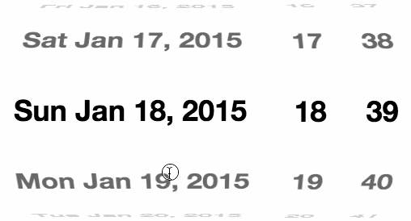

famous-flex-datepicker
==========

Date/time picker demo for famo.us using the [famous-flex](https://github.com/IjzerenHein/famous-flex) DatePicker. This project shows how to create a native feeling cross-platform date-picker using famo.us.




[View the live demo here](https://rawgit.com/IjzerenHein/famous-flex-datepicker/master/dist/index.html)


## Tutorial

-	[DatePicker Tutorial](./tutorial/DatePicker.md)


## Examples

-	[Date example](./src/date/DateExample.js) [(CSS)](./src/date/styles.css)
-	[Date + Time example](./src/datetime/DateTimeExample.js) [(CSS)](./src/datetime/styles.css)
-	[Time example](./src/time/TimeExample.js) [(CSS)](./src/time/styles.css)
-	[Clock example](./src/clock/ClockExample.js) [(CSS)](./src/clock/styles.css)


## Build

To build the demo, make sure grunt, webpack and webpack-dev-server are installed globally:

```
npm install -g grunt
npm install -g webpack
npm install -g webpack-dev-server
```

Run npm to install all dev-dependencies:

```
npm install
```

To build the output (dist-folder), run the webpack command:

```
webpack
```


## Running

To run the demo either open `dist/index.html`

Or use the live-reload server:

```
grunt serve
```


## Contribute

If you like this project and want to support it, show some love
and give it a star.


## Contact
- 	@IjzerenHein
- 	http://www.gloey.nl
- 	hrutjes@gmail.com (for hire)

© 2015 - Hein Rutjes
