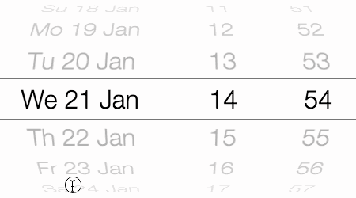
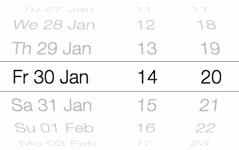
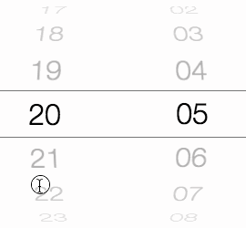

DatePicker Tutorial
==========

DatePicker is a date/time picker-wheel based on the famous-flex LayoutController technology. It combines one or more
ScrollControllers using the WheelLayout layout to form a single date/time picker control.



[View the live demo here](https://rawgit.com/IjzerenHein/famous-flex-datepicker/master/dist/index.html)


# Index

- [Getting started](#getting-started)
- Resources:
    - [API reference](https://github.com/IjzerenHein/famous-flex/blob/master/docs/widgets/DatePicker.md)
    - [DateTime example](../src/datetime/DateTimeExample.js) [(CSS)](../src/datetime/styles.css)
    - [Date example](../src/date/DateExample.js) [(CSS)](../src/date/styles.css)
    - [Time example](../src/time/TimeExample.js) [(CSS)](../src/time/styles.css)
    - [Clock example](../src/clock/ClockExample.js) [(CSS)](../src/clock/styles.css)
- [Renderables & CSS-classes](#renderables--css-classes)
    - [Custom renderables](#custom-renderables)
    - [CSS classes](#css-classes)
    - [Overview of renderables and their CSS-selectors](#overview-of-renderables-and-their-css-selectors)
- [Components](#components)
    - [Customizing components](#customizing-components)
- [Getting and setting the selected date](#getting-and-setting-the-selected-date)
- [Events](#events)
- [Perspective & wheel options](#perspective--wheel-options)
- [Internationalisation & custom formatting](#internationalisation--custom-formatting)
- [Disabling user-input](#disabling-user-input)
- [Disabling item looping](#disabling-item-looping)


# Getting started

To use the DatePicker in your project, install famous-flex using npm or bower:

    npm install famous-flex

    bower install famous-flex

Include the widgets css file in your project:

Using webpack:

```javascript
require('famous-flex/widgets/styles.css');
```

Or in your html file:

```html
<head>
  <link rel="stylesheet" type="text/css" href="famous-flex/src/widgets/styles.css">
</head>
```

To create the DatePicker use:

```javascript
var DatePicker = require('famous-flex/widgets/DatePicker');

var datePicker = new DatePicker({
    date: new Date(),        // initial date
    wheelLayout: {           // layout-options that are passed to the `WheelLayout`
        itemSize: 100,       // height of an item on the date/wheel
        diameter: 300        // diameter of the wheel (undefined = 3 x itemSize)
    }
});
datePicker.setComponents([
    new DatePicker.Component.FullDay(),  // full-day component (year + month + day)
    new DatePicker.Component.Hour(),     // hour component (0..23)
    new DatePicker.Component.Minute()    // minute compoent (0..59)
]);
this.add(datePicker); // add to the render-tree
```


# Renderables & CSS classes

By default, the DatePicker only creates renderables (Surfaces) for the scrollable wheels.
You can choose to enable other renderables, such as the top, bottom and middle-overlays.
To enable these renderables, set their values in the `createRenderables` option to `true`.

```javascript
var datePicker = new DatePicker({
    createRenderables: {
        top: true,
        middle: true
        bottom: true
    }
});
```

## Custom renderables

To create or use your own renderables, specify a factory `Function`
instead of `true/false`:

```javascript
var datePicker = new DatePicker({
    createRenderables: {
        item: function(id, data) {
            return new Surface({
                content: data,
                properties: {
                    background: 'rgba(255, 255, 255, 0.5)',
                    color: '#222222'
                }
            })
        }
    }
});
```

## CSS classes

When a Surface is created, it is assigned multiple css-classes which can be
styled from a css-file. The `widgets/styles.css` already contains various styles
so that texts are nicely centered. The following example sets the font-size and
color for all scroll-wheel items:

```css
.ff-datepicker.item {
    color: #333333;
    font-size: 20px
}
```

To customize a specific component, add the component id to the css-selector:

```css
.ff-datepicker.item.year {
    text-align: left; /* left-align the year component */
}
```


## Overview of renderables and their CSS-selectors

|Renderable|CSS-selector|Description|
|---|---|---|
|`item`|`.ff-datepicker.item`|Item on a scroll-wheel.|
|`top`|`.ff-datepicker.top`|Top overlay renderable.|
|`middle`|`.ff-datepicker.middle`|Middle overlay renderable (overlays the selected item).|
|`bottom`|`.ff-datepicker.bottom`|Bottom overlay renderable.|


## Example of a white date-picker with transparent top & bottom overlays:



In order to create a "theme", you can assign additional css-classes to the renderables
by specifying the `classes` option in the constructor:

```javascript
var datePicker = new DatePicker({
    perspective: 500,
    wheelLayout: {
        itemSize: 60,
        diameter: 320,
        radialOpacity: -0.5
    },
    classes: ['white'],
    createRenderables: {
        top: true,
        bottom: true
    }
});
```

CSS:

```css
.ff-datepicker.item.white {
  font-size: 36px;
  font-weight: 100;
}
.ff-datepicker.top.white {
  background-color: rgba(255, 255, 255, 0.6);
  border-bottom: 1px solid #777777;
}
.ff-datepicker.bottom.white {
  background-color: rgba(255, 255, 255, 0.6);
  border-top: 1px solid #777777;
}
```


# Components

DatePicker is shipped with various components out of the box.

|Component|CSS-class|Description|
|---|---|---|
|`DatePicker.Component.Year`|`.year`|4 digit year component.|
|`DatePicker.Component.Month`|`.month`|Month component (e.g. 'July').|
|`DatePicker.Component.FullDay`|`.fullday`|Full day component including year, month & day.|
|`DatePicker.Component.WeekDay`|`.weekday`|Day of the week (e.g. 'Monday').|
|`DatePicker.Component.Day`|`.day`|1 or 2 digit day of the month (e.g. 31).|
|`DatePicker.Component.Hour`|`.hour`|2 digit hour component.|
|`DatePicker.Component.Minute`|`.minute`|2 digit minute component.|
|`DatePicker.Component.Second`|`.second`|2 digit second component.|
|`DatePicker.Component.Millisecond`|`.millisecond`|3 digit millisecond component.|


## Customizing components

All components share a set of properties which can customized:

|Property|Type|Description|
|---|---|---|
|`sizeRatio`|`Number`|Width-ratio the component occupies in the date-picker (the sum of all sizeRatio's equals a width of 100%).|
|`step`|`Number`|The value by which the component is incremented/decremented when scrolling up/down.|
|`loop`|`Bool`|When set to `true` causes the component to loop when min/max is reached (default: `true`).|
|`format`|`Function`|Function that formats the component into a string (see [Internationalisation & custom formatting](#internationalisation--custom-formatting)).|

Example:

```javascript
var datePicker = new DatePicker();
datePicker.setComponents([
    new DatePicker.Component.FullDay({
        sizeRatio: 5,   // occupy 50% width
        format: function (date) {
            // format the date the way you want
            return date.toLocaleDateString();
        }
    }),
    new DatePicker.Component.Hour({
        sizeRatio: 2.5  // occupy 25% width
    }),
    new DatePicker.Component.Minute({
        step: 15,       // Select increments of 15 minutes
        sizeRatio: 2.5  // occupy 25% width
    })
]);
```


# Getting and setting the selected date

To get and set the date, use `getDate` and `setDate`:

```javascript
// To set the initial date, specify it in the constructor
datePicker = new DatePicker({
    date: new Date(), // specify initial date
    ...
});

// Get and set the date
datePicker.setDate(new Date());
var date = datePicker.getDate();
```


# Events

When the date-wheels are scrolled or `setDate` is called, the following
events are emitted:

|event        |description|
|-------------|-----------|
|`scrollstart`|Emitted when scrolling starts.|
|`datechange` |Emitted immediately whenever the selected date changes.|
|`scrollend`  |Emitted after scrolling stops (after all the scroll particle have settled).|

To capture the newly selected date/time, use either `datechange` or
`scrollend`:

```javascript
// The `datechange` event is emitted immediately after the date
// has been changed.
datePicker.on('datechange', function(event) {
    console.log('date-changed to: ' + event.date.toString());
});

// The `scrollend` event is emitted after all date-wheel
// components have come to a halt.
datePicker.on('scrollend', function(event) {
    console.log('scrolling has ended: ' + event.date.toString());
});
```


# Perspective & wheel options

The options for the DatePicker can be specified in the constructor
or using `setOptions`. The `wheelLayout` options are passed as-is to the
underlying `WheelLayout` layout.

```javascript
var datePicker = new DatePicker({
    perspective: 2000,     // perspective used for the wheel layout
    wheelLayout: {         // layout-options that are passed to the `WheelLayout`
        itemSize: 50,      // height of single item on the date-wheel
        diameter: 200,     // diameter of the wheel in pixels
        radialOpacity: 0.5 // opacity at the top & bottom edges of the wheels
    }
});
datePicker.setComponents([
    // use `sizeRatio' to define the width of each component
    new DatePicker.Component.Hour({sizeRatio: 5}),   // 50% width
    new DatePicker.Component.Minute({sizeRatio: 2}), // 20% width
    new DatePicker.Component.Second({sizeRatio: 3}), // 30% width
]);
```


# Internationalisation & custom formatting

By default the `Month` and `WeekDay` components are formatted in English.
If you want to format a component using a different locale, use the
formatting library of your choice. The following example uses [momentjs](http://momentjs.com) to format the month in the currently selected locale:

```javascript
var moment = require('moment/moment');

var datePicker = new DatePicker({..});
datePicker.setComponents([
    new DatePicker.Component.Year(),
    new DatePicker.Component.Month({
        // uses momentjs to format the full month in the current locale
        format: function(date) {
            return moment(date).format('MMMM');
        }
    }),
    new DatePicker.Component.Day()
]);
```


# Disabling user-input

To disable user scrolling (e.g. to build a clock), set the `enabled` option of the underlying
scroll-controllers to `false`, like this:

```javascript
var datePicker = new DatePicker({
    scrollController: {
        enabled: false
    }
});
```

You can use this method to override any of the default options of the underlying ScrollControllers.


# Disabling item looping

By default, components such as `Hour`, `Minute`, `Month` are round robined when they reach the
start or end. To disable this "looping" behavior, set the `loop` option for the component to `false`.



```javascript
var datePicker = new DatePicker();
datePicker.setComponents([
    new DatePicker.Component.Hour({
        loop: false
    }),
    new DatePicker.Component.Minute({
        loop: false
    })
]);
```

*© 2015 IjzerenHein*
